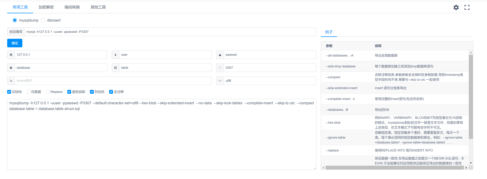
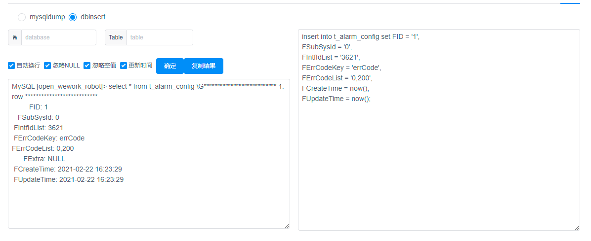

# Mysqldump
使用工具自动生成mysqldump命令
## 功能一
mysqldump 填入登录mysql的命令，可以生成mysqldump命令，用于DB数据导出

## 功能二
dbinsert 填入mysql终端select的结果，生成insert语句

> mysqldump和dbinsert为自己编写
其余摘自浏览器插件的开源工具[Ctool 程序开发常用工具]https://github.com/baiy/Ctool

> 应用商店: https://chrome.google.com/webstore/detail/ctool-%E7%A8%8B%E5%BA%8F%E5%BC%80%E5%8F%91%E5%B8%B8%E7%94%A8%E5%B7%A5%E5%85%B7/ipfcebkfhpkjeikaammlkcnalknjahmh?utm_source=chrome-ntp-icon